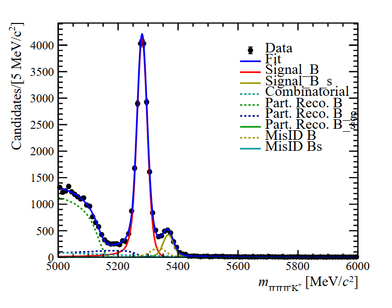

### 2026-06-22

- 利用RapidSim生成了丢失光子的部分重建模拟数据，root文件位置为[/data5/lhcb/liuyl/B2A1K/RapidSim/build/B2a2K_tree.root](/data5/lhcb/liuyl/B2A1K/RapidSim/build/B2a2K_tree.root)，注意此时质量单位是$\mathrm{GeV/c^2}$，而质量谱拟合中是$\mathrm{MeV/c^2}$

- 利用产生的模拟数据提取部分重建的形状，拟合丢失$\gamma$的质量谱，文件位置为[/data5/lhcb/liuyl/B2A1K/7.FitMass/FitToData_compare4.py](/data5/lhcb/liuyl/B2A1K/7.FitMass/FitToData_compare4.py)，拟合得到质量谱形状如图

